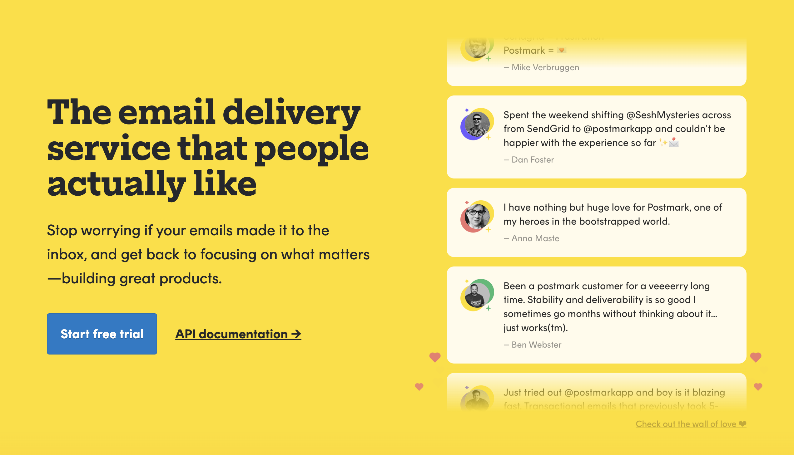

<div align="left">

[](https://postmarkapp.com)

# Postmark<a id="postmark"></a>

Postmark makes sending and receiving email
incredibly easy.


</div>

## Table of Contents<a id="table-of-contents"></a>

<!-- toc -->

- [Requirements](#requirements)
- [Installation](#installation)
- [Getting Started](#getting-started)
- [Async](#async)
- [Raw HTTP Response](#raw-http-response)
- [Reference](#reference)
  * [`postmark.bounces_api.activate_bounce`](#postmarkbounces_apiactivate_bounce)
  * [`postmark.bounces_api.get_bounce`](#postmarkbounces_apiget_bounce)
  * [`postmark.bounces_api.get_delivery_stats`](#postmarkbounces_apiget_delivery_stats)
  * [`postmark.bounces_api.get_dump`](#postmarkbounces_apiget_dump)
  * [`postmark.bounces_api.list_bounces`](#postmarkbounces_apilist_bounces)
  * [`postmark.inbound_rules_api.create_trigger`](#postmarkinbound_rules_apicreate_trigger)
  * [`postmark.inbound_rules_api.delete_single_trigger`](#postmarkinbound_rules_apidelete_single_trigger)
  * [`postmark.inbound_rules_api.list_triggers`](#postmarkinbound_rules_apilist_triggers)
  * [`postmark.messages_api.get_all_clicks`](#postmarkmessages_apiget_all_clicks)
  * [`postmark.messages_api.get_inbound_message_details`](#postmarkmessages_apiget_inbound_message_details)
  * [`postmark.messages_api.get_message_clicks`](#postmarkmessages_apiget_message_clicks)
  * [`postmark.messages_api.get_message_dump`](#postmarkmessages_apiget_message_dump)
  * [`postmark.messages_api.get_message_opens`](#postmarkmessages_apiget_message_opens)
  * [`postmark.messages_api.get_outbound_message_details`](#postmarkmessages_apiget_outbound_message_details)
  * [`postmark.messages_api.list_opens_for_outbound`](#postmarkmessages_apilist_opens_for_outbound)
  * [`postmark.messages_api.retry_inbound_message`](#postmarkmessages_apiretry_inbound_message)
  * [`postmark.messages_api.search_inbound_messages`](#postmarkmessages_apisearch_inbound_messages)
  * [`postmark.messages_api.search_outbound_messages`](#postmarkmessages_apisearch_outbound_messages)
  * [`postmark.messages_api.update_bypass_rules_for_inbound_message`](#postmarkmessages_apiupdate_bypass_rules_for_inbound_message)
  * [`postmark.sending_api.send_batch_emails`](#postmarksending_apisend_batch_emails)
  * [`postmark.sending_api.send_batch_with_templates`](#postmarksending_apisend_batch_with_templates)
  * [`postmark.sending_api.send_email_template`](#postmarksending_apisend_email_template)
  * [`postmark.sending_api.send_single_email`](#postmarksending_apisend_single_email)
  * [`postmark.server_configuration_api.get_configuration`](#postmarkserver_configuration_apiget_configuration)
  * [`postmark.server_configuration_api.update_configuration`](#postmarkserver_configuration_apiupdate_configuration)
  * [`postmark.stats_api.get_bounce_counts`](#postmarkstats_apiget_bounce_counts)
  * [`postmark.stats_api.get_browser_platform_usage`](#postmarkstats_apiget_browser_platform_usage)
  * [`postmark.stats_api.get_email_client_usage`](#postmarkstats_apiget_email_client_usage)
  * [`postmark.stats_api.get_email_open_counts`](#postmarkstats_apiget_email_open_counts)
  * [`postmark.stats_api.get_email_platform_usage`](#postmarkstats_apiget_email_platform_usage)
  * [`postmark.stats_api.get_outbound_click_counts`](#postmarkstats_apiget_outbound_click_counts)
  * [`postmark.stats_api.get_outbound_clicks_browser_families`](#postmarkstats_apiget_outbound_clicks_browser_families)
  * [`postmark.stats_api.get_outbound_clicks_location`](#postmarkstats_apiget_outbound_clicks_location)
  * [`postmark.stats_api.get_outbound_overview`](#postmarkstats_apiget_outbound_overview)
  * [`postmark.stats_api.get_sent_counts`](#postmarkstats_apiget_sent_counts)
  * [`postmark.stats_api.get_spam_complaints`](#postmarkstats_apiget_spam_complaints)
  * [`postmark.stats_api.get_tracked_email_counts`](#postmarkstats_apiget_tracked_email_counts)
  * [`postmark.templates_api.create_template`](#postmarktemplates_apicreate_template)
  * [`postmark.templates_api.delete_template`](#postmarktemplates_apidelete_template)
  * [`postmark.templates_api.get_template_by_id`](#postmarktemplates_apiget_template_by_id)
  * [`postmark.templates_api.list_templates`](#postmarktemplates_apilist_templates)
  * [`postmark.templates_api.send_batch_with_templates`](#postmarktemplates_apisend_batch_with_templates)
  * [`postmark.templates_api.send_email_template`](#postmarktemplates_apisend_email_template)
  * [`postmark.templates_api.update_template`](#postmarktemplates_apiupdate_template)
  * [`postmark.templates_api.validate_template_content`](#postmarktemplates_apivalidate_template_content)

<!-- tocstop -->

## Requirements<a id="requirements"></a>

Python >=3.7

## Installation<a id="installation"></a>
<div align="center">
  <a href="https://konfigthis.com/sdk-sign-up?company=Postmark&language=Python">
    
  </a>
</div>

## Getting Started<a id="getting-started"></a>

```python
from pprint import pprint
from postmark_python_sdk import Postmark, ApiException

postmark = Postmark(
    server_token="YOUR_API_KEY",
)

try:
    # Activate a bounce
    activate_bounce_response = postmark.bounces_api.activate_bounce(
        bounceid=1,
    )
except ApiException as e:
    print("Exception when calling BouncesAPIApi.activate_bounce: %s\n" % e)
    pprint(e.body)
    if e.status == 422:
        pprint(e.body["error_code"])
        pprint(e.body["message"])
    pprint(e.headers)
    pprint(e.status)
    pprint(e.reason)
    pprint(e.round_trip_time)
```

## Async<a id="async"></a>

`async` support is available by prepending `a` to any method.

```python
import asyncio
from pprint import pprint
from postmark_python_sdk import Postmark, ApiException

postmark = Postmark(
    server_token="YOUR_API_KEY",
)


async def main():
    try:
        # Activate a bounce
        activate_bounce_response = await postmark.bounces_api.aactivate_bounce(
            bounceid=1,
        )
    except ApiException as e:
        print("Exception when calling BouncesAPIApi.activate_bounce: %s\n" % e)
        pprint(e.body)
        if e.status == 422:
            pprint(e.body["error_code"])
            pprint(e.body["message"])
        pprint(e.headers)
        pprint(e.status)
        pprint(e.reason)
        pprint(e.round_trip_time)


asyncio.run(main())
```

## Raw HTTP Response<a id="raw-http-response"></a>

To access raw HTTP response values, use the `.raw` namespace.

```python
from pprint import pprint
from postmark_python_sdk import Postmark, ApiException

postmark = Postmark(
    server_token="YOUR_API_KEY",
)

try:
    # Activate a bounce
    activate_bounce_response = postmark.bounces_api.raw.activate_bounce(
        bounceid=1,
    )
    pprint(activate_bounce_response.headers)
    pprint(activate_bounce_response.status)
    pprint(activate_bounce_response.round_trip_time)
except ApiException as e:
    print("Exception when calling BouncesAPIApi.activate_bounce: %s\n" % e)
    pprint(e.body)
    if e.status == 422:
        pprint(e.body["error_code"])
        pprint(e.body["message"])
    pprint(e.headers)
    pprint(e.status)
    pprint(e.reason)
    pprint(e.round_trip_time)
```


## Reference<a id="reference"></a>
### `postmark.bounces_api.activate_bounce`<a id="postmarkbounces_apiactivate_bounce"></a>

Activate a bounce

#### 🛠️ Usage<a id="🛠️-usage"></a>

```python
activate_bounce_response = postmark.bounces_api.activate_bounce(
    bounceid=1,
)
```

#### ⚙️ Parameters<a id="⚙️-parameters"></a>

##### bounceid: `int`<a id="bounceid-int"></a>

The ID of the Bounce to activate.

#### 🌐 Endpoint<a id="🌐-endpoint"></a>

`/bounces/{bounceid}/activate` `put`

[🔙 **Back to Table of Contents**](#table-of-contents)

---

### `postmark.bounces_api.get_bounce`<a id="postmarkbounces_apiget_bounce"></a>

Get a single bounce

#### 🛠️ Usage<a id="🛠️-usage"></a>

```python
get_bounce_response = postmark.bounces_api.get_bounce(
    bounceid=1,
)
```

#### ⚙️ Parameters<a id="⚙️-parameters"></a>

##### bounceid: `int`<a id="bounceid-int"></a>

The ID of the bounce to retrieve.

#### 🌐 Endpoint<a id="🌐-endpoint"></a>

`/bounces/{bounceid}` `get`

[🔙 **Back to Table of Contents**](#table-of-contents)

---

### `postmark.bounces_api.get_delivery_stats`<a id="postmarkbounces_apiget_delivery_stats"></a>

Get delivery stats

#### 🛠️ Usage<a id="🛠️-usage"></a>

```python
get_delivery_stats_response = postmark.bounces_api.get_delivery_stats()
```

#### 🔄 Return<a id="🔄-return"></a>

[`DeliveryStatsResponse`](./postmark_python_sdk/pydantic/delivery_stats_response.py)

#### 🌐 Endpoint<a id="🌐-endpoint"></a>

`/deliverystats` `get`

[🔙 **Back to Table of Contents**](#table-of-contents)

---

### `postmark.bounces_api.get_dump`<a id="postmarkbounces_apiget_dump"></a>

Get bounce dump

#### 🛠️ Usage<a id="🛠️-usage"></a>

```python
get_dump_response = postmark.bounces_api.get_dump(
    bounceid=1,
)
```

#### ⚙️ Parameters<a id="⚙️-parameters"></a>

##### bounceid: `int`<a id="bounceid-int"></a>

The ID for the bounce dump to retrieve.

#### 🌐 Endpoint<a id="🌐-endpoint"></a>

`/bounces/{bounceid}/dump` `get`

[🔙 **Back to Table of Contents**](#table-of-contents)

---

### `postmark.bounces_api.list_bounces`<a id="postmarkbounces_apilist_bounces"></a>

Get bounces

#### 🛠️ Usage<a id="🛠️-usage"></a>

```python
list_bounces_response = postmark.bounces_api.list_bounces(
    count=1,
    offset=1,
    type="HardBounce",
    inactive=True,
    email_filter="string_example",
    message_id="string_example",
    tag="string_example",
    todate="1970-01-01",
    fromdate="1970-01-01",
)
```

#### ⚙️ Parameters<a id="⚙️-parameters"></a>

##### count: `int`<a id="count-int"></a>

Number of bounces to return per request. Max 500.

##### offset: `int`<a id="offset-int"></a>

Number of bounces to skip.

##### type: `str`<a id="type-str"></a>

Filter by type of bounce

##### inactive: `bool`<a id="inactive-bool"></a>

Filter by emails that were deactivated by Postmark due to the bounce. Set to true or false. If this isn't specified it will return both active and inactive.

##### email_filter: `str`<a id="email_filter-str"></a>

Filter by email address

##### message_id: `str`<a id="message_id-str"></a>

Filter by messageID

##### tag: `str`<a id="tag-str"></a>

Filter by tag

##### todate: `date`<a id="todate-date"></a>

Filter messages up to the date specified. e.g. `2014-02-01`

##### fromdate: `date`<a id="fromdate-date"></a>

Filter messages starting from the date specified. e.g. `2014-02-01`

#### 🔄 Return<a id="🔄-return"></a>

[`BounceSearchResponse`](./postmark_python_sdk/pydantic/bounce_search_response.py)

#### 🌐 Endpoint<a id="🌐-endpoint"></a>

`/bounces` `get`

[🔙 **Back to Table of Contents**](#table-of-contents)

---

### `postmark.inbound_rules_api.create_trigger`<a id="postmarkinbound_rules_apicreate_trigger"></a>

Create an inbound rule trigger

#### 🛠️ Usage<a id="🛠️-usage"></a>

```python
create_trigger_response = postmark.inbound_rules_api.create_trigger(
    body=None,
    rule="string_example",
)
```

#### ⚙️ Parameters<a id="⚙️-parameters"></a>

##### rule: `str`<a id="rule-str"></a>

#### ⚙️ Request Body<a id="⚙️-request-body"></a>

[`CreateInboundRuleRequest`](./postmark_python_sdk/type/create_inbound_rule_request.py)
#### 🌐 Endpoint<a id="🌐-endpoint"></a>

`/triggers/inboundrules` `post`

[🔙 **Back to Table of Contents**](#table-of-contents)

---

### `postmark.inbound_rules_api.delete_single_trigger`<a id="postmarkinbound_rules_apidelete_single_trigger"></a>

Delete a single trigger

#### 🛠️ Usage<a id="🛠️-usage"></a>

```python
delete_single_trigger_response = postmark.inbound_rules_api.delete_single_trigger(
    triggerid=1,
)
```

#### ⚙️ Parameters<a id="⚙️-parameters"></a>

##### triggerid: `int`<a id="triggerid-int"></a>

The ID of the Inbound Rule that should be deleted.

#### 🔄 Return<a id="🔄-return"></a>

[`StandardPostmarkResponse`](./postmark_python_sdk/pydantic/standard_postmark_response.py)

#### 🌐 Endpoint<a id="🌐-endpoint"></a>

`/triggers/inboundrules/{triggerid}` `delete`

[🔙 **Back to Table of Contents**](#table-of-contents)

---

### `postmark.inbound_rules_api.list_triggers`<a id="postmarkinbound_rules_apilist_triggers"></a>

List inbound rule triggers

#### 🛠️ Usage<a id="🛠️-usage"></a>

```python
list_triggers_response = postmark.inbound_rules_api.list_triggers(
    count=1,
    offset=1,
)
```

#### ⚙️ Parameters<a id="⚙️-parameters"></a>

##### count: `int`<a id="count-int"></a>

Number of records to return per request.

##### offset: `int`<a id="offset-int"></a>

Number of records to skip.

#### 🌐 Endpoint<a id="🌐-endpoint"></a>

`/triggers/inboundrules` `get`

[🔙 **Back to Table of Contents**](#table-of-contents)

---

### `postmark.messages_api.get_all_clicks`<a id="postmarkmessages_apiget_all_clicks"></a>

Clicks for a all messages

#### 🛠️ Usage<a id="🛠️-usage"></a>

```python
get_all_clicks_response = postmark.messages_api.get_all_clicks(
    count=1,
    offset=1,
    recipient="string_example",
    tag="string_example",
    client_name="string_example",
    client_company="string_example",
    client_family="string_example",
    os_name="string_example",
    os_family="string_example",
    os_company="string_example",
    platform="string_example",
    country="string_example",
    region="string_example",
    city="string_example",
)
```

#### ⚙️ Parameters<a id="⚙️-parameters"></a>

##### count: `int`<a id="count-int"></a>

Number of message clicks to return per request. Max 500.

##### offset: `int`<a id="offset-int"></a>

Number of messages to skip

##### recipient: `str`<a id="recipient-str"></a>

Filter by To, Cc, Bcc

##### tag: `str`<a id="tag-str"></a>

Filter by tag

##### client_name: `str`<a id="client_name-str"></a>

Filter by client name, i.e. Outlook, Gmail

##### client_company: `str`<a id="client_company-str"></a>

Filter by company, i.e. Microsoft, Apple, Google

##### client_family: `str`<a id="client_family-str"></a>

Filter by client family, i.e. OS X, Chrome

##### os_name: `str`<a id="os_name-str"></a>

Filter by full OS name and specific version, i.e. OS X 10.9 Mavericks, Windows 7

##### os_family: `str`<a id="os_family-str"></a>

Filter by kind of OS used without specific version, i.e. OS X, Windows

##### os_company: `str`<a id="os_company-str"></a>

Filter by company which produced the OS, i.e. Apple Computer, Inc., Microsoft Corporation

##### platform: `str`<a id="platform-str"></a>

Filter by platform, i.e. webmail, desktop, mobile

##### country: `str`<a id="country-str"></a>

Filter by country messages were opened in, i.e. Denmark, Russia

##### region: `str`<a id="region-str"></a>

Filter by full name of region messages were opened in, i.e. Moscow, New York

##### city: `str`<a id="city-str"></a>

Filter by full name of region messages were opened in, i.e. Moscow, New York

#### 🌐 Endpoint<a id="🌐-endpoint"></a>

`/messages/outbound/clicks` `get`

[🔙 **Back to Table of Contents**](#table-of-contents)

---

### `postmark.messages_api.get_inbound_message_details`<a id="postmarkmessages_apiget_inbound_message_details"></a>

Inbound message details

#### 🛠️ Usage<a id="🛠️-usage"></a>

```python
get_inbound_message_details_response = (
    postmark.messages_api.get_inbound_message_details(
        messageid="messageid_example",
    )
)
```

#### ⚙️ Parameters<a id="⚙️-parameters"></a>

##### messageid: `str`<a id="messageid-str"></a>

The ID of the message for which to details will be retrieved.

#### 🌐 Endpoint<a id="🌐-endpoint"></a>

`/messages/inbound/{messageid}/details` `get`

[🔙 **Back to Table of Contents**](#table-of-contents)

---

### `postmark.messages_api.get_message_clicks`<a id="postmarkmessages_apiget_message_clicks"></a>

Retrieve Message Clicks

#### 🛠️ Usage<a id="🛠️-usage"></a>

```python
get_message_clicks_response = postmark.messages_api.get_message_clicks(
    messageid="messageid_example",
    count=1,
    offset=0,
)
```

#### ⚙️ Parameters<a id="⚙️-parameters"></a>

##### messageid: `str`<a id="messageid-str"></a>

The ID of the Outbound Message for which click statistics should be retrieved.

##### count: `int`<a id="count-int"></a>

Number of message clicks to return per request. Max 500.

##### offset: `int`<a id="offset-int"></a>

Number of messages to skip.

#### 🌐 Endpoint<a id="🌐-endpoint"></a>

`/messages/outbound/clicks/{messageid}` `get`

[🔙 **Back to Table of Contents**](#table-of-contents)

---

### `postmark.messages_api.get_message_dump`<a id="postmarkmessages_apiget_message_dump"></a>

Outbound message dump

#### 🛠️ Usage<a id="🛠️-usage"></a>

```python
get_message_dump_response = postmark.messages_api.get_message_dump(
    messageid="messageid_example",
)
```

#### ⚙️ Parameters<a id="⚙️-parameters"></a>

##### messageid: `str`<a id="messageid-str"></a>

The ID of the message for which to retrieve a dump.

#### 🌐 Endpoint<a id="🌐-endpoint"></a>

`/messages/outbound/{messageid}/dump` `get`

[🔙 **Back to Table of Contents**](#table-of-contents)

---

### `postmark.messages_api.get_message_opens`<a id="postmarkmessages_apiget_message_opens"></a>

Retrieve Message Opens

#### 🛠️ Usage<a id="🛠️-usage"></a>

```python
get_message_opens_response = postmark.messages_api.get_message_opens(
    messageid="messageid_example",
    count=1,
    offset=0,
)
```

#### ⚙️ Parameters<a id="⚙️-parameters"></a>

##### messageid: `str`<a id="messageid-str"></a>

The ID of the Outbound Message for which open statistics should be retrieved.

##### count: `int`<a id="count-int"></a>

Number of message opens to return per request. Max 500.

##### offset: `int`<a id="offset-int"></a>

Number of messages to skip.

#### 🌐 Endpoint<a id="🌐-endpoint"></a>

`/messages/outbound/opens/{messageid}` `get`

[🔙 **Back to Table of Contents**](#table-of-contents)

---

### `postmark.messages_api.get_outbound_message_details`<a id="postmarkmessages_apiget_outbound_message_details"></a>

Outbound message details

#### 🛠️ Usage<a id="🛠️-usage"></a>

```python
get_outbound_message_details_response = (
    postmark.messages_api.get_outbound_message_details(
        messageid="messageid_example",
    )
)
```

#### ⚙️ Parameters<a id="⚙️-parameters"></a>

##### messageid: `str`<a id="messageid-str"></a>

The ID of the message for which to retrieve details.

#### 🌐 Endpoint<a id="🌐-endpoint"></a>

`/messages/outbound/{messageid}/details` `get`

[🔙 **Back to Table of Contents**](#table-of-contents)

---

### `postmark.messages_api.list_opens_for_outbound`<a id="postmarkmessages_apilist_opens_for_outbound"></a>

Opens for all messages

#### 🛠️ Usage<a id="🛠️-usage"></a>

```python
list_opens_for_outbound_response = postmark.messages_api.list_opens_for_outbound(
    count=1,
    offset=1,
    recipient="string_example",
    tag="string_example",
    client_name="string_example",
    client_company="string_example",
    client_family="string_example",
    os_name="string_example",
    os_family="string_example",
    os_company="string_example",
    platform="string_example",
    country="string_example",
    region="string_example",
    city="string_example",
)
```

#### ⚙️ Parameters<a id="⚙️-parameters"></a>

##### count: `int`<a id="count-int"></a>

Number of message opens to return per request. Max 500.

##### offset: `int`<a id="offset-int"></a>

Number of messages to skip

##### recipient: `str`<a id="recipient-str"></a>

Filter by To, Cc, Bcc

##### tag: `str`<a id="tag-str"></a>

Filter by tag

##### client_name: `str`<a id="client_name-str"></a>

Filter by client name, i.e. Outlook, Gmail

##### client_company: `str`<a id="client_company-str"></a>

Filter by company, i.e. Microsoft, Apple, Google

##### client_family: `str`<a id="client_family-str"></a>

Filter by client family, i.e. OS X, Chrome

##### os_name: `str`<a id="os_name-str"></a>

Filter by full OS name and specific version, i.e. OS X 10.9 Mavericks, Windows 7

##### os_family: `str`<a id="os_family-str"></a>

Filter by kind of OS used without specific version, i.e. OS X, Windows

##### os_company: `str`<a id="os_company-str"></a>

Filter by company which produced the OS, i.e. Apple Computer, Inc., Microsoft Corporation

##### platform: `str`<a id="platform-str"></a>

Filter by platform, i.e. webmail, desktop, mobile

##### country: `str`<a id="country-str"></a>

Filter by country messages were opened in, i.e. Denmark, Russia

##### region: `str`<a id="region-str"></a>

Filter by full name of region messages were opened in, i.e. Moscow, New York

##### city: `str`<a id="city-str"></a>

Filter by full name of region messages were opened in, i.e. Moscow, New York

#### 🌐 Endpoint<a id="🌐-endpoint"></a>

`/messages/outbound/opens` `get`

[🔙 **Back to Table of Contents**](#table-of-contents)

---

### `postmark.messages_api.retry_inbound_message`<a id="postmarkmessages_apiretry_inbound_message"></a>

Retry a failed inbound message for processing

#### 🛠️ Usage<a id="🛠️-usage"></a>

```python
retry_inbound_message_response = postmark.messages_api.retry_inbound_message(
    messageid="messageid_example",
)
```

#### ⚙️ Parameters<a id="⚙️-parameters"></a>

##### messageid: `str`<a id="messageid-str"></a>

The ID of the inbound message on which we should retry processing.

#### 🔄 Return<a id="🔄-return"></a>

[`StandardPostmarkResponse`](./postmark_python_sdk/pydantic/standard_postmark_response.py)

#### 🌐 Endpoint<a id="🌐-endpoint"></a>

`/messages/inbound/{messageid}/retry` `put`

[🔙 **Back to Table of Contents**](#table-of-contents)

---

### `postmark.messages_api.search_inbound_messages`<a id="postmarkmessages_apisearch_inbound_messages"></a>

Inbound message search

#### 🛠️ Usage<a id="🛠️-usage"></a>

```python
search_inbound_messages_response = postmark.messages_api.search_inbound_messages(
    count=1,
    offset=1,
    recipient="string_example",
    fromemail="string_example",
    subject="string_example",
    mailboxhash="string_example",
    tag="string_example",
    status="blocked",
    todate="1970-01-01",
    fromdate="1970-01-01",
)
```

#### ⚙️ Parameters<a id="⚙️-parameters"></a>

##### count: `int`<a id="count-int"></a>

Number of messages to return per request. Max 500.

##### offset: `int`<a id="offset-int"></a>

Number of messages to skip

##### recipient: `str`<a id="recipient-str"></a>

Filter by the user who was receiving the email

##### fromemail: `str`<a id="fromemail-str"></a>

Filter by the sender email address

##### subject: `str`<a id="subject-str"></a>

Filter by email subject

##### mailboxhash: `str`<a id="mailboxhash-str"></a>

Filter by mailboxhash

##### tag: `str`<a id="tag-str"></a>

Filter by tag

##### status: `str`<a id="status-str"></a>

Filter by status (`blocked`, `processed`, `queued`, `failed`, `scheduled`)

##### todate: `date`<a id="todate-date"></a>

Filter messages up to the date specified. e.g. `2014-02-01`

##### fromdate: `date`<a id="fromdate-date"></a>

Filter messages starting from the date specified. e.g. `2014-02-01`

#### 🔄 Return<a id="🔄-return"></a>

[`InboundSearchResponse`](./postmark_python_sdk/pydantic/inbound_search_response.py)

#### 🌐 Endpoint<a id="🌐-endpoint"></a>

`/messages/inbound` `get`

[🔙 **Back to Table of Contents**](#table-of-contents)

---

### `postmark.messages_api.search_outbound_messages`<a id="postmarkmessages_apisearch_outbound_messages"></a>

Outbound message search

#### 🛠️ Usage<a id="🛠️-usage"></a>

```python
search_outbound_messages_response = postmark.messages_api.search_outbound_messages(
    count=1,
    offset=1,
    recipient="string_example",
    fromemail="string_example",
    tag="string_example",
    status="queued",
    todate="1970-01-01",
    fromdate="1970-01-01",
)
```

#### ⚙️ Parameters<a id="⚙️-parameters"></a>

##### count: `int`<a id="count-int"></a>

Number of messages to return per request. Max 500.

##### offset: `int`<a id="offset-int"></a>

Number of messages to skip

##### recipient: `str`<a id="recipient-str"></a>

Filter by the user who was receiving the email

##### fromemail: `str`<a id="fromemail-str"></a>

Filter by the sender email address

##### tag: `str`<a id="tag-str"></a>

Filter by tag

##### status: `str`<a id="status-str"></a>

Filter by status (`queued` or `sent`)

##### todate: `date`<a id="todate-date"></a>

Filter messages up to the date specified. e.g. `2014-02-01`

##### fromdate: `date`<a id="fromdate-date"></a>

Filter messages starting from the date specified. e.g. `2014-02-01`

#### 🔄 Return<a id="🔄-return"></a>

[`OutboundSearchResponse`](./postmark_python_sdk/pydantic/outbound_search_response.py)

#### 🌐 Endpoint<a id="🌐-endpoint"></a>

`/messages/outbound` `get`

[🔙 **Back to Table of Contents**](#table-of-contents)

---

### `postmark.messages_api.update_bypass_rules_for_inbound_message`<a id="postmarkmessages_apiupdate_bypass_rules_for_inbound_message"></a>

Bypass rules for a blocked inbound message

#### 🛠️ Usage<a id="🛠️-usage"></a>

```python
update_bypass_rules_for_inbound_message_response = (
    postmark.messages_api.update_bypass_rules_for_inbound_message(
        messageid="messageid_example",
    )
)
```

#### ⚙️ Parameters<a id="⚙️-parameters"></a>

##### messageid: `str`<a id="messageid-str"></a>

The ID of the message which should bypass inbound rules.

#### 🔄 Return<a id="🔄-return"></a>

[`StandardPostmarkResponse`](./postmark_python_sdk/pydantic/standard_postmark_response.py)

#### 🌐 Endpoint<a id="🌐-endpoint"></a>

`/messages/inbound/{messageid}/bypass` `put`

[🔙 **Back to Table of Contents**](#table-of-contents)

---

### `postmark.sending_api.send_batch_emails`<a id="postmarksending_apisend_batch_emails"></a>

Send a batch of emails

#### 🛠️ Usage<a id="🛠️-usage"></a>

```python
send_batch_emails_response = postmark.sending_api.send_batch_emails(
    body=[None],
)
```

#### ⚙️ Request Body<a id="⚙️-request-body"></a>

[`SendEmailBatchRequest`](./postmark_python_sdk/type/send_email_batch_request.py)
#### 🔄 Return<a id="🔄-return"></a>

[`SendEmailBatchResponse`](./postmark_python_sdk/pydantic/send_email_batch_response.py)

#### 🌐 Endpoint<a id="🌐-endpoint"></a>

`/email/batch` `post`

[🔙 **Back to Table of Contents**](#table-of-contents)

---

### `postmark.sending_api.send_batch_with_templates`<a id="postmarksending_apisend_batch_with_templates"></a>

Send a batch of email using templates.

#### 🛠️ Usage<a id="🛠️-usage"></a>

```python
send_batch_with_templates_response = postmark.sending_api.send_batch_with_templates(
    body=None,
    messages=[None],
)
```

#### ⚙️ Parameters<a id="⚙️-parameters"></a>

##### messages: List[`EmailWithTemplateRequest`]<a id="messages-listemailwithtemplaterequest"></a>

#### ⚙️ Request Body<a id="⚙️-request-body"></a>

[`SendEmailTemplatedBatchRequest`](./postmark_python_sdk/type/send_email_templated_batch_request.py)
#### 🔄 Return<a id="🔄-return"></a>

[`SendEmailBatchResponse`](./postmark_python_sdk/pydantic/send_email_batch_response.py)

#### 🌐 Endpoint<a id="🌐-endpoint"></a>

`/email/batchWithTemplates` `post`

[🔙 **Back to Table of Contents**](#table-of-contents)

---

### `postmark.sending_api.send_email_template`<a id="postmarksending_apisend_email_template"></a>

Send an email using a Template

#### 🛠️ Usage<a id="🛠️-usage"></a>

```python
send_email_template_response = postmark.sending_api.send_email_template(
    body=None,
    _from="string_example",
    template_alias="string_example",
    template_id=1,
    template_model={},
    to="string_example",
    attachments=[None],
    bcc="string_example",
    cc="string_example",
    headers=[None],
    inline_css=True,
    reply_to="string_example",
    tag="string_example",
    track_links="None",
    track_opens=True,
)
```

#### ⚙️ Parameters<a id="⚙️-parameters"></a>

##### _from: `str`<a id="_from-str"></a>

##### template_alias: `str`<a id="template_alias-str"></a>

Required if 'TemplateId' is not specified.

##### template_id: `int`<a id="template_id-int"></a>

Required if 'TemplateAlias' is not specified.

##### template_model: `Dict[str, Union[bool, date, datetime, dict, float, int, list, str, None]]`<a id="template_model-dictstr-unionbool-date-datetime-dict-float-int-list-str-none"></a>

##### to: `str`<a id="to-str"></a>

##### attachments: [`AttachmentCollection`](./postmark_python_sdk/type/attachment_collection.py)<a id="attachments-attachmentcollectionpostmark_python_sdktypeattachment_collectionpy"></a>

##### bcc: `str`<a id="bcc-str"></a>

##### cc: `str`<a id="cc-str"></a>

##### headers: [`HeaderCollection`](./postmark_python_sdk/type/header_collection.py)<a id="headers-headercollectionpostmark_python_sdktypeheader_collectionpy"></a>

##### inline_css: `bool`<a id="inline_css-bool"></a>

##### reply_to: `str`<a id="reply_to-str"></a>

##### tag: `str`<a id="tag-str"></a>

##### track_links: `str`<a id="track_links-str"></a>

Replace links in content to enable \\\"click tracking\\\" stats. Default is 'null', which uses the server's LinkTracking setting'.

##### track_opens: `bool`<a id="track_opens-bool"></a>

Activate open tracking for this email.

#### ⚙️ Request Body<a id="⚙️-request-body"></a>

[`EmailWithTemplateRequest`](./postmark_python_sdk/type/email_with_template_request.py)
#### 🔄 Return<a id="🔄-return"></a>

[`SendEmailResponse`](./postmark_python_sdk/pydantic/send_email_response.py)

#### 🌐 Endpoint<a id="🌐-endpoint"></a>

`/email/withTemplate` `post`

[🔙 **Back to Table of Contents**](#table-of-contents)

---

### `postmark.sending_api.send_single_email`<a id="postmarksending_apisend_single_email"></a>

Send a single email

#### 🛠️ Usage<a id="🛠️-usage"></a>

```python
send_single_email_response = postmark.sending_api.send_single_email(
    body=None,
    attachments=[None],
    bcc="string_example",
    cc="string_example",
    _from="string_example",
    headers=[None],
    html_body="string_example",
    reply_to="string_example",
    subject="string_example",
    tag="string_example",
    text_body="string_example",
    to="string_example",
    track_links="None",
    track_opens=True,
)
```

#### ⚙️ Parameters<a id="⚙️-parameters"></a>

##### attachments: [`AttachmentCollection`](./postmark_python_sdk/type/attachment_collection.py)<a id="attachments-attachmentcollectionpostmark_python_sdktypeattachment_collectionpy"></a>

##### bcc: `str`<a id="bcc-str"></a>

Bcc recipient email address. Multiple addresses are comma seperated. Max 50.

##### cc: `str`<a id="cc-str"></a>

Recipient email address. Multiple addresses are comma seperated. Max 50.

##### _from: `str`<a id="_from-str"></a>

The sender email address. Must have a registered and confirmed Sender Signature.

##### headers: [`HeaderCollection`](./postmark_python_sdk/type/header_collection.py)<a id="headers-headercollectionpostmark_python_sdktypeheader_collectionpy"></a>

##### html_body: `str`<a id="html_body-str"></a>

If no TextBody specified HTML email message

##### reply_to: `str`<a id="reply_to-str"></a>

Reply To override email address. Defaults to the Reply To set in the sender signature.

##### subject: `str`<a id="subject-str"></a>

Email Subject

##### tag: `str`<a id="tag-str"></a>

Email tag that allows you to categorize outgoing emails and get detailed statistics.

##### text_body: `str`<a id="text_body-str"></a>

If no HtmlBody specified Plain text email message

##### to: `str`<a id="to-str"></a>

Recipient email address. Multiple addresses are comma seperated. Max 50.

##### track_links: `str`<a id="track_links-str"></a>

Replace links in content to enable \\\"click tracking\\\" stats. Default is 'null', which uses the server's LinkTracking setting'.

##### track_opens: `bool`<a id="track_opens-bool"></a>

Activate open tracking for this email.

#### ⚙️ Request Body<a id="⚙️-request-body"></a>

[`SendEmailRequest`](./postmark_python_sdk/type/send_email_request.py)
#### 🔄 Return<a id="🔄-return"></a>

[`SendEmailResponse`](./postmark_python_sdk/pydantic/send_email_response.py)

#### 🌐 Endpoint<a id="🌐-endpoint"></a>

`/email` `post`

[🔙 **Back to Table of Contents**](#table-of-contents)

---

### `postmark.server_configuration_api.get_configuration`<a id="postmarkserver_configuration_apiget_configuration"></a>

Get Server Configuration

#### 🛠️ Usage<a id="🛠️-usage"></a>

```python
get_configuration_response = postmark.server_configuration_api.get_configuration()
```

#### 🌐 Endpoint<a id="🌐-endpoint"></a>

`/server` `get`

[🔙 **Back to Table of Contents**](#table-of-contents)

---

### `postmark.server_configuration_api.update_configuration`<a id="postmarkserver_configuration_apiupdate_configuration"></a>

Edit Server Configuration

#### 🛠️ Usage<a id="🛠️-usage"></a>

```python
update_configuration_response = postmark.server_configuration_api.update_configuration(
    body=None,
    bounce_hook_url="string_example",
    click_hook_url="string_example",
    color="purple",
    delivery_hook_url="string_example",
    inbound_domain="string_example",
    inbound_hook_url="string_example",
    inbound_spam_threshold=1,
    name="string_example",
    open_hook_url="string_example",
    post_first_open_only=True,
    raw_email_enabled=True,
    smtp_api_activated=True,
    track_links="None",
    track_opens=True,
)
```

#### ⚙️ Parameters<a id="⚙️-parameters"></a>

##### bounce_hook_url: `str`<a id="bounce_hook_url-str"></a>

##### click_hook_url: `str`<a id="click_hook_url-str"></a>

Webhook url allowing real-time notification when tracked links are clicked.

##### color: `str`<a id="color-str"></a>

##### delivery_hook_url: `str`<a id="delivery_hook_url-str"></a>

##### inbound_domain: `str`<a id="inbound_domain-str"></a>

##### inbound_hook_url: `str`<a id="inbound_hook_url-str"></a>

##### inbound_spam_threshold: `int`<a id="inbound_spam_threshold-int"></a>

##### name: `str`<a id="name-str"></a>

##### open_hook_url: `str`<a id="open_hook_url-str"></a>

##### post_first_open_only: `bool`<a id="post_first_open_only-bool"></a>

##### raw_email_enabled: `bool`<a id="raw_email_enabled-bool"></a>

##### smtp_api_activated: `bool`<a id="smtp_api_activated-bool"></a>

##### track_links: `str`<a id="track_links-str"></a>

##### track_opens: `bool`<a id="track_opens-bool"></a>

#### ⚙️ Request Body<a id="⚙️-request-body"></a>

[`EditServerConfigurationRequest`](./postmark_python_sdk/type/edit_server_configuration_request.py)
The settings that should be modified for the current server.

#### 🌐 Endpoint<a id="🌐-endpoint"></a>

`/server` `put`

[🔙 **Back to Table of Contents**](#table-of-contents)

---

### `postmark.stats_api.get_bounce_counts`<a id="postmarkstats_apiget_bounce_counts"></a>

Get bounce counts

#### 🛠️ Usage<a id="🛠️-usage"></a>

```python
get_bounce_counts_response = postmark.stats_api.get_bounce_counts(
    tag="string_example",
    fromdate="1970-01-01",
    todate="1970-01-01",
)
```

#### ⚙️ Parameters<a id="⚙️-parameters"></a>

##### tag: `str`<a id="tag-str"></a>

Filter by tag

##### fromdate: `date`<a id="fromdate-date"></a>

Filter stats starting from the date specified. e.g. `2014-01-01`

##### todate: `date`<a id="todate-date"></a>

Filter stats up to the date specified. e.g. `2014-02-01`

#### 🌐 Endpoint<a id="🌐-endpoint"></a>

`/stats/outbound/bounces` `get`

[🔙 **Back to Table of Contents**](#table-of-contents)

---

### `postmark.stats_api.get_browser_platform_usage`<a id="postmarkstats_apiget_browser_platform_usage"></a>

Get browser plaform usage

#### 🛠️ Usage<a id="🛠️-usage"></a>

```python
get_browser_platform_usage_response = postmark.stats_api.get_browser_platform_usage(
    tag="string_example",
    fromdate="1970-01-01",
    todate="1970-01-01",
)
```

#### ⚙️ Parameters<a id="⚙️-parameters"></a>

##### tag: `str`<a id="tag-str"></a>

Filter by tag

##### fromdate: `date`<a id="fromdate-date"></a>

Filter stats starting from the date specified. e.g. `2014-01-01`

##### todate: `date`<a id="todate-date"></a>

Filter stats up to the date specified. e.g. `2014-02-01`

#### 🌐 Endpoint<a id="🌐-endpoint"></a>

`/stats/outbound/clicks/platforms` `get`

[🔙 **Back to Table of Contents**](#table-of-contents)

---

### `postmark.stats_api.get_email_client_usage`<a id="postmarkstats_apiget_email_client_usage"></a>

Get email client usage

#### 🛠️ Usage<a id="🛠️-usage"></a>

```python
get_email_client_usage_response = postmark.stats_api.get_email_client_usage(
    tag="string_example",
    fromdate="1970-01-01",
    todate="1970-01-01",
)
```

#### ⚙️ Parameters<a id="⚙️-parameters"></a>

##### tag: `str`<a id="tag-str"></a>

Filter by tag

##### fromdate: `date`<a id="fromdate-date"></a>

Filter stats starting from the date specified. e.g. `2014-01-01`

##### todate: `date`<a id="todate-date"></a>

Filter stats up to the date specified. e.g. `2014-02-01`

#### 🌐 Endpoint<a id="🌐-endpoint"></a>

`/stats/outbound/opens/emailclients` `get`

[🔙 **Back to Table of Contents**](#table-of-contents)

---

### `postmark.stats_api.get_email_open_counts`<a id="postmarkstats_apiget_email_open_counts"></a>

Get email open counts

#### 🛠️ Usage<a id="🛠️-usage"></a>

```python
get_email_open_counts_response = postmark.stats_api.get_email_open_counts(
    tag="string_example",
    fromdate="1970-01-01",
    todate="1970-01-01",
)
```

#### ⚙️ Parameters<a id="⚙️-parameters"></a>

##### tag: `str`<a id="tag-str"></a>

Filter by tag

##### fromdate: `date`<a id="fromdate-date"></a>

Filter stats starting from the date specified. e.g. `2014-01-01`

##### todate: `date`<a id="todate-date"></a>

Filter stats up to the date specified. e.g. `2014-02-01`

#### 🌐 Endpoint<a id="🌐-endpoint"></a>

`/stats/outbound/opens` `get`

[🔙 **Back to Table of Contents**](#table-of-contents)

---

### `postmark.stats_api.get_email_platform_usage`<a id="postmarkstats_apiget_email_platform_usage"></a>

Get email platform usage

#### 🛠️ Usage<a id="🛠️-usage"></a>

```python
get_email_platform_usage_response = postmark.stats_api.get_email_platform_usage(
    tag="string_example",
    fromdate="1970-01-01",
    todate="1970-01-01",
)
```

#### ⚙️ Parameters<a id="⚙️-parameters"></a>

##### tag: `str`<a id="tag-str"></a>

Filter by tag

##### fromdate: `date`<a id="fromdate-date"></a>

Filter stats starting from the date specified. e.g. `2014-01-01`

##### todate: `date`<a id="todate-date"></a>

Filter stats up to the date specified. e.g. `2014-02-01`

#### 🌐 Endpoint<a id="🌐-endpoint"></a>

`/stats/outbound/opens/platforms` `get`

[🔙 **Back to Table of Contents**](#table-of-contents)

---

### `postmark.stats_api.get_outbound_click_counts`<a id="postmarkstats_apiget_outbound_click_counts"></a>

Get click counts

#### 🛠️ Usage<a id="🛠️-usage"></a>

```python
get_outbound_click_counts_response = postmark.stats_api.get_outbound_click_counts(
    tag="string_example",
    fromdate="1970-01-01",
    todate="1970-01-01",
)
```

#### ⚙️ Parameters<a id="⚙️-parameters"></a>

##### tag: `str`<a id="tag-str"></a>

Filter by tag

##### fromdate: `date`<a id="fromdate-date"></a>

Filter stats starting from the date specified. e.g. `2014-01-01`

##### todate: `date`<a id="todate-date"></a>

Filter stats up to the date specified. e.g. `2014-02-01`

#### 🌐 Endpoint<a id="🌐-endpoint"></a>

`/stats/outbound/clicks` `get`

[🔙 **Back to Table of Contents**](#table-of-contents)

---

### `postmark.stats_api.get_outbound_clicks_browser_families`<a id="postmarkstats_apiget_outbound_clicks_browser_families"></a>

Get browser usage by family

#### 🛠️ Usage<a id="🛠️-usage"></a>

```python
get_outbound_clicks_browser_families_response = (
    postmark.stats_api.get_outbound_clicks_browser_families(
        tag="string_example",
        fromdate="1970-01-01",
        todate="1970-01-01",
    )
)
```

#### ⚙️ Parameters<a id="⚙️-parameters"></a>

##### tag: `str`<a id="tag-str"></a>

Filter by tag

##### fromdate: `date`<a id="fromdate-date"></a>

Filter stats starting from the date specified. e.g. `2014-01-01`

##### todate: `date`<a id="todate-date"></a>

Filter stats up to the date specified. e.g. `2014-02-01`

#### 🌐 Endpoint<a id="🌐-endpoint"></a>

`/stats/outbound/clicks/browserfamilies` `get`

[🔙 **Back to Table of Contents**](#table-of-contents)

---

### `postmark.stats_api.get_outbound_clicks_location`<a id="postmarkstats_apiget_outbound_clicks_location"></a>

Get clicks by body location

#### 🛠️ Usage<a id="🛠️-usage"></a>

```python
get_outbound_clicks_location_response = postmark.stats_api.get_outbound_clicks_location(
    tag="string_example",
    fromdate="1970-01-01",
    todate="1970-01-01",
)
```

#### ⚙️ Parameters<a id="⚙️-parameters"></a>

##### tag: `str`<a id="tag-str"></a>

Filter by tag

##### fromdate: `date`<a id="fromdate-date"></a>

Filter stats starting from the date specified. e.g. `2014-01-01`

##### todate: `date`<a id="todate-date"></a>

Filter stats up to the date specified. e.g. `2014-02-01`

#### 🌐 Endpoint<a id="🌐-endpoint"></a>

`/stats/outbound/clicks/location` `get`

[🔙 **Back to Table of Contents**](#table-of-contents)

---

### `postmark.stats_api.get_outbound_overview`<a id="postmarkstats_apiget_outbound_overview"></a>

Get outbound overview

#### 🛠️ Usage<a id="🛠️-usage"></a>

```python
get_outbound_overview_response = postmark.stats_api.get_outbound_overview(
    tag="string_example",
    fromdate="1970-01-01",
    todate="1970-01-01",
)
```

#### ⚙️ Parameters<a id="⚙️-parameters"></a>

##### tag: `str`<a id="tag-str"></a>

Filter by tag

##### fromdate: `date`<a id="fromdate-date"></a>

Filter stats starting from the date specified. e.g. `2014-01-01`

##### todate: `date`<a id="todate-date"></a>

Filter stats up to the date specified. e.g. `2014-02-01`

#### 🔄 Return<a id="🔄-return"></a>

[`OutboundOverviewStatsResponse`](./postmark_python_sdk/pydantic/outbound_overview_stats_response.py)

#### 🌐 Endpoint<a id="🌐-endpoint"></a>

`/stats/outbound` `get`

[🔙 **Back to Table of Contents**](#table-of-contents)

---

### `postmark.stats_api.get_sent_counts`<a id="postmarkstats_apiget_sent_counts"></a>

Get sent counts

#### 🛠️ Usage<a id="🛠️-usage"></a>

```python
get_sent_counts_response = postmark.stats_api.get_sent_counts(
    tag="string_example",
    fromdate="1970-01-01",
    todate="1970-01-01",
)
```

#### ⚙️ Parameters<a id="⚙️-parameters"></a>

##### tag: `str`<a id="tag-str"></a>

Filter by tag

##### fromdate: `date`<a id="fromdate-date"></a>

Filter stats starting from the date specified. e.g. `2014-01-01`

##### todate: `date`<a id="todate-date"></a>

Filter stats up to the date specified. e.g. `2014-02-01`

#### 🔄 Return<a id="🔄-return"></a>

[`SentCountsResponse`](./postmark_python_sdk/pydantic/sent_counts_response.py)

#### 🌐 Endpoint<a id="🌐-endpoint"></a>

`/stats/outbound/sends` `get`

[🔙 **Back to Table of Contents**](#table-of-contents)

---

### `postmark.stats_api.get_spam_complaints`<a id="postmarkstats_apiget_spam_complaints"></a>

Get spam complaints

#### 🛠️ Usage<a id="🛠️-usage"></a>

```python
get_spam_complaints_response = postmark.stats_api.get_spam_complaints(
    tag="string_example",
    fromdate="1970-01-01",
    todate="1970-01-01",
)
```

#### ⚙️ Parameters<a id="⚙️-parameters"></a>

##### tag: `str`<a id="tag-str"></a>

Filter by tag

##### fromdate: `date`<a id="fromdate-date"></a>

Filter stats starting from the date specified. e.g. `2014-01-01`

##### todate: `date`<a id="todate-date"></a>

Filter stats up to the date specified. e.g. `2014-02-01`

#### 🌐 Endpoint<a id="🌐-endpoint"></a>

`/stats/outbound/spam` `get`

[🔙 **Back to Table of Contents**](#table-of-contents)

---

### `postmark.stats_api.get_tracked_email_counts`<a id="postmarkstats_apiget_tracked_email_counts"></a>

Get tracked email counts

#### 🛠️ Usage<a id="🛠️-usage"></a>

```python
get_tracked_email_counts_response = postmark.stats_api.get_tracked_email_counts(
    tag="string_example",
    fromdate="1970-01-01",
    todate="1970-01-01",
)
```

#### ⚙️ Parameters<a id="⚙️-parameters"></a>

##### tag: `str`<a id="tag-str"></a>

Filter by tag

##### fromdate: `date`<a id="fromdate-date"></a>

Filter stats starting from the date specified. e.g. `2014-01-01`

##### todate: `date`<a id="todate-date"></a>

Filter stats starting from the date specified. e.g. `2014-01-01`

#### 🌐 Endpoint<a id="🌐-endpoint"></a>

`/stats/outbound/tracked` `get`

[🔙 **Back to Table of Contents**](#table-of-contents)

---

### `postmark.templates_api.create_template`<a id="postmarktemplates_apicreate_template"></a>

Create a Template

#### 🛠️ Usage<a id="🛠️-usage"></a>

```python
create_template_response = postmark.templates_api.create_template(
    body=None,
    name="string_example",
    subject="string_example",
    alias="string_example",
    html_body="string_example",
    text_body="string_example",
)
```

#### ⚙️ Parameters<a id="⚙️-parameters"></a>

##### name: `str`<a id="name-str"></a>

The friendly display name for the template.

##### subject: `str`<a id="subject-str"></a>

The Subject template definition for this Template.

##### alias: `str`<a id="alias-str"></a>

The optional string identifier for referring to this Template (numbers, letters, and '.', '-', '_' characters, starts with a letter).

##### html_body: `str`<a id="html_body-str"></a>

The HTML template definition for this Template.

##### text_body: `str`<a id="text_body-str"></a>

The Text template definition for this Template.

#### ⚙️ Request Body<a id="⚙️-request-body"></a>

[`CreateTemplateRequest`](./postmark_python_sdk/type/create_template_request.py)
#### 🌐 Endpoint<a id="🌐-endpoint"></a>

`/templates` `post`

[🔙 **Back to Table of Contents**](#table-of-contents)

---

### `postmark.templates_api.delete_template`<a id="postmarktemplates_apidelete_template"></a>

Delete a Template

#### 🛠️ Usage<a id="🛠️-usage"></a>

```python
delete_template_response = postmark.templates_api.delete_template(
    template_id_or_alias="templateIdOrAlias_example",
)
```

#### ⚙️ Parameters<a id="⚙️-parameters"></a>

##### template_id_or_alias: `str`<a id="template_id_or_alias-str"></a>

The 'TemplateID' or 'Alias' value for the Template you wish to delete.

#### 🌐 Endpoint<a id="🌐-endpoint"></a>

`/templates/{templateIdOrAlias}` `delete`

[🔙 **Back to Table of Contents**](#table-of-contents)

---

### `postmark.templates_api.get_template_by_id`<a id="postmarktemplates_apiget_template_by_id"></a>

Get a Template

#### 🛠️ Usage<a id="🛠️-usage"></a>

```python
get_template_by_id_response = postmark.templates_api.get_template_by_id(
    template_id_or_alias="templateIdOrAlias_example",
)
```

#### ⚙️ Parameters<a id="⚙️-parameters"></a>

##### template_id_or_alias: `str`<a id="template_id_or_alias-str"></a>

The 'TemplateID' or 'Alias' value for the Template you wish to retrieve.

#### 🌐 Endpoint<a id="🌐-endpoint"></a>

`/templates/{templateIdOrAlias}` `get`

[🔙 **Back to Table of Contents**](#table-of-contents)

---

### `postmark.templates_api.list_templates`<a id="postmarktemplates_apilist_templates"></a>

Get the Templates associated with this Server

#### 🛠️ Usage<a id="🛠️-usage"></a>

```python
list_templates_response = postmark.templates_api.list_templates(
    count=3.14,
    offset=3.14,
)
```

#### ⚙️ Parameters<a id="⚙️-parameters"></a>

##### count: `Union[int, float]`<a id="count-unionint-float"></a>

The number of Templates to return

##### offset: `Union[int, float]`<a id="offset-unionint-float"></a>

The number of Templates to \"skip\" before returning results.

#### 🌐 Endpoint<a id="🌐-endpoint"></a>

`/templates` `get`

[🔙 **Back to Table of Contents**](#table-of-contents)

---

### `postmark.templates_api.send_batch_with_templates`<a id="postmarktemplates_apisend_batch_with_templates"></a>

Send a batch of email using templates.

#### 🛠️ Usage<a id="🛠️-usage"></a>

```python
send_batch_with_templates_response = postmark.templates_api.send_batch_with_templates(
    body=None,
    messages=[None],
)
```

#### ⚙️ Parameters<a id="⚙️-parameters"></a>

##### messages: List[`EmailWithTemplateRequest`]<a id="messages-listemailwithtemplaterequest"></a>

#### ⚙️ Request Body<a id="⚙️-request-body"></a>

[`SendEmailTemplatedBatchRequest`](./postmark_python_sdk/type/send_email_templated_batch_request.py)
#### 🔄 Return<a id="🔄-return"></a>

[`SendEmailBatchResponse`](./postmark_python_sdk/pydantic/send_email_batch_response.py)

#### 🌐 Endpoint<a id="🌐-endpoint"></a>

`/email/batchWithTemplates` `post`

[🔙 **Back to Table of Contents**](#table-of-contents)

---

### `postmark.templates_api.send_email_template`<a id="postmarktemplates_apisend_email_template"></a>

Send an email using a Template

#### 🛠️ Usage<a id="🛠️-usage"></a>

```python
send_email_template_response = postmark.templates_api.send_email_template(
    body=None,
    _from="string_example",
    template_alias="string_example",
    template_id=1,
    template_model={},
    to="string_example",
    attachments=[None],
    bcc="string_example",
    cc="string_example",
    headers=[None],
    inline_css=True,
    reply_to="string_example",
    tag="string_example",
    track_links="None",
    track_opens=True,
)
```

#### ⚙️ Parameters<a id="⚙️-parameters"></a>

##### _from: `str`<a id="_from-str"></a>

##### template_alias: `str`<a id="template_alias-str"></a>

Required if 'TemplateId' is not specified.

##### template_id: `int`<a id="template_id-int"></a>

Required if 'TemplateAlias' is not specified.

##### template_model: `Dict[str, Union[bool, date, datetime, dict, float, int, list, str, None]]`<a id="template_model-dictstr-unionbool-date-datetime-dict-float-int-list-str-none"></a>

##### to: `str`<a id="to-str"></a>

##### attachments: [`AttachmentCollection`](./postmark_python_sdk/type/attachment_collection.py)<a id="attachments-attachmentcollectionpostmark_python_sdktypeattachment_collectionpy"></a>

##### bcc: `str`<a id="bcc-str"></a>

##### cc: `str`<a id="cc-str"></a>

##### headers: [`HeaderCollection`](./postmark_python_sdk/type/header_collection.py)<a id="headers-headercollectionpostmark_python_sdktypeheader_collectionpy"></a>

##### inline_css: `bool`<a id="inline_css-bool"></a>

##### reply_to: `str`<a id="reply_to-str"></a>

##### tag: `str`<a id="tag-str"></a>

##### track_links: `str`<a id="track_links-str"></a>

Replace links in content to enable \\\"click tracking\\\" stats. Default is 'null', which uses the server's LinkTracking setting'.

##### track_opens: `bool`<a id="track_opens-bool"></a>

Activate open tracking for this email.

#### ⚙️ Request Body<a id="⚙️-request-body"></a>

[`EmailWithTemplateRequest`](./postmark_python_sdk/type/email_with_template_request.py)
#### 🔄 Return<a id="🔄-return"></a>

[`SendEmailResponse`](./postmark_python_sdk/pydantic/send_email_response.py)

#### 🌐 Endpoint<a id="🌐-endpoint"></a>

`/email/withTemplate` `post`

[🔙 **Back to Table of Contents**](#table-of-contents)

---

### `postmark.templates_api.update_template`<a id="postmarktemplates_apiupdate_template"></a>

Update a Template

#### 🛠️ Usage<a id="🛠️-usage"></a>

```python
update_template_response = postmark.templates_api.update_template(
    body=None,
    template_id_or_alias="templateIdOrAlias_example",
    alias="string_example",
    html_body="string_example",
    name="string_example",
    subject="string_example",
    text_body="string_example",
)
```

#### ⚙️ Parameters<a id="⚙️-parameters"></a>

##### template_id_or_alias: `str`<a id="template_id_or_alias-str"></a>

The 'TemplateID' or 'Alias' value for the Template you wish to update.

##### alias: `str`<a id="alias-str"></a>

The optional string identifier for referring to this Template (numbers, letters, and '.', '-', '_' characters, starts with a letter).

##### html_body: `str`<a id="html_body-str"></a>

The HTML template definition for this Template.

##### name: `str`<a id="name-str"></a>

The friendly display name for the template.

##### subject: `str`<a id="subject-str"></a>

The Subject template definition for this Template.

##### text_body: `str`<a id="text_body-str"></a>

The Text template definition for this Template.

#### ⚙️ Request Body<a id="⚙️-request-body"></a>

[`EditTemplateRequest`](./postmark_python_sdk/type/edit_template_request.py)
#### 🌐 Endpoint<a id="🌐-endpoint"></a>

`/templates/{templateIdOrAlias}` `put`

[🔙 **Back to Table of Contents**](#table-of-contents)

---

### `postmark.templates_api.validate_template_content`<a id="postmarktemplates_apivalidate_template_content"></a>

Test Template Content

#### 🛠️ Usage<a id="🛠️-usage"></a>

```python
validate_template_content_response = postmark.templates_api.validate_template_content(
    body=None,
    html_body="string_example",
    inline_css_for_html_test_render=True,
    subject="string_example",
    test_render_model={},
    text_body="string_example",
)
```

#### ⚙️ Parameters<a id="⚙️-parameters"></a>

##### html_body: `str`<a id="html_body-str"></a>

The html body content to validate. Must be specified if Subject or TextBody are not. See our template language documentation for more information on the syntax for this field. 

##### inline_css_for_html_test_render: `bool`<a id="inline_css_for_html_test_render-bool"></a>

When HtmlBody is specified, the test render will have style blocks inlined as style attributes on matching html elements. You may disable the css inlining behavior by passing false for this parameter. 

##### subject: `str`<a id="subject-str"></a>

The subject content to validate. Must be specified if HtmlBody or TextBody are not. See our template language documentation for more information on the syntax for this field. 

##### test_render_model: `Dict[str, Union[bool, date, datetime, dict, float, int, list, str, None]]`<a id="test_render_model-dictstr-unionbool-date-datetime-dict-float-int-list-str-none"></a>

The model to be used when rendering test content.

##### text_body: `str`<a id="text_body-str"></a>

The text body content to validate. Must be specified if HtmlBody or Subject are not. See our template language documentation for more information on the syntax for this field. 

#### ⚙️ Request Body<a id="⚙️-request-body"></a>

[`TemplateValidationRequest`](./postmark_python_sdk/type/template_validation_request.py)
#### 🌐 Endpoint<a id="🌐-endpoint"></a>

`/templates/validate` `post`

[🔙 **Back to Table of Contents**](#table-of-contents)

---


## Author<a id="author"></a>
This Python package is automatically generated by [Konfig](https://konfigthis.com)
